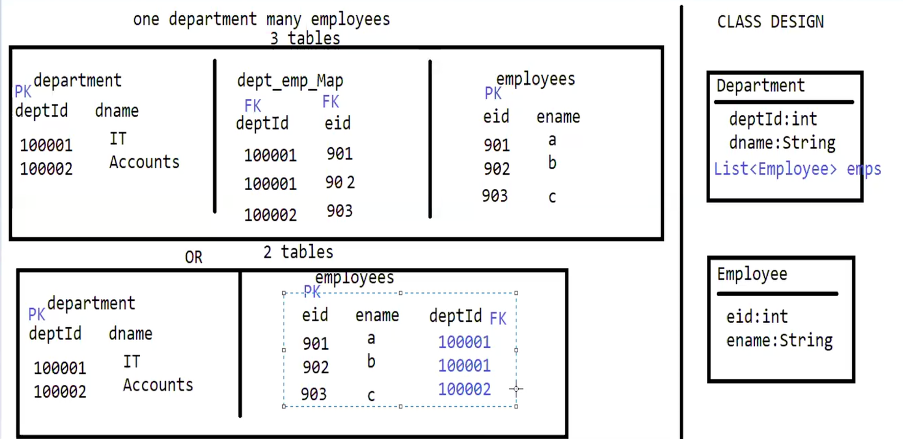
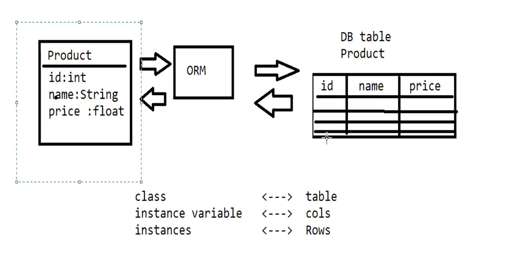
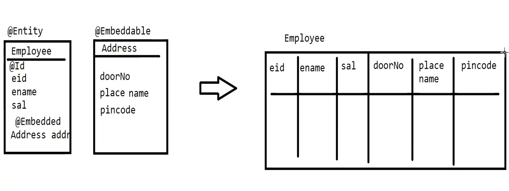

#### JPA with hibernate and Spring Boot

This project demonstrates how to set up a Spring Boot application with JPA using Hibernate as the ORM.
Java Persistence API (JPA) is a specification for managing relational data in Java applications. It has many interfaces
which are implemented by various ORM frameworks, and Hibernate is one of the most popular implementations of JPA.

Hibernate is a popular Object-Relational Mapping (ORM) framework for Java applications. It simplifies database
interactions by allowing developers to work with Java objects instead of SQL queries. In this example, we will create a
simple Spring Boot application that uses Hibernate to perform CRUD (Create, Read, Update, Delete) operations on a
database.

##### problems in JDBC

1. Boilerplate Code: JDBC requires a lot of boilerplate code for tasks like establishing connections, preparing
   statements,
   and handling result sets. This can lead to repetitive and error-prone code.
2. Manual Mapping: Developers need to manually map database rows to Java objects, which can be tedious and error-prone.
3. Lack of Abstraction: JDBC operates at a low level, making it difficult to work with complex data models and
   relationships.
4. Transaction Management: Managing transactions manually can be complex and error-prone, especially in applications
   with multiple
   database operations.
5. Database Portability: JDBC code is often tightly coupled to a specific database, making it challenging to switch
   databases.

If you have 2-3 columns in a table, JDBC is fine. But if you have 10-15 columns in a table, then it becomes difficult to
manage the code.
Data types is also a problem. For example, if you have a date column in the table, then you need to convert it to
java.util.Date or java.sql.Date.
Handling relationships (HAS A/IS A) between tables is also a problem. For example, if you have a one-to-many
relationship between two tables, then you need to write
complex SQL queries to fetch the data.
Here Department HAS many employees. It is HAS A relationship. You need to create list of employees in the Department
class and write complex SQL queries to fetch the data.

##### Why Hibernate?

1. Simplified Data Access: Hibernate abstracts away the low-level JDBC code, allowing developers to work with
   high-level
   APIs and Java objects.
2. Object-Relational Mapping: Hibernate automatically maps database tables to Java classes, reducing the need for
   manual mapping.
3. Query Language: Hibernate provides HQL (Hibernate Query Language), which is a powerful and flexible query language
   that allows developers to write database queries using Java objects.

#### Creating entity class for a table which has employee details and address details

Employee has one-to-one relationship with Address. One Employee has one Address.

Employee details and address details are stored in same table. Address is a component of Employee. It is HAS A relationship.
We will create two classes Employee and Address. Address class will be embedded in Employee class using @Embeddable.

@Entity annotation is used to specify that the class is an entity and is mapped to a database table.
@Id annotation is used to specify the primary key of an entity.
@Embeddable annotation is used to specify that a class is a component and can be embedded in another entity.
@Embedded annotation is used to specify that a component is embedded in an entity.

#### When table is already created in the database
The table name in the database is employee_info. But I want to map it to Employee class. So I will use @Table annotation to
specify the table name.

#### Transaction Management
Read https://www.geeksforgeeks.org/dbms/acid-properties-in-dbms/