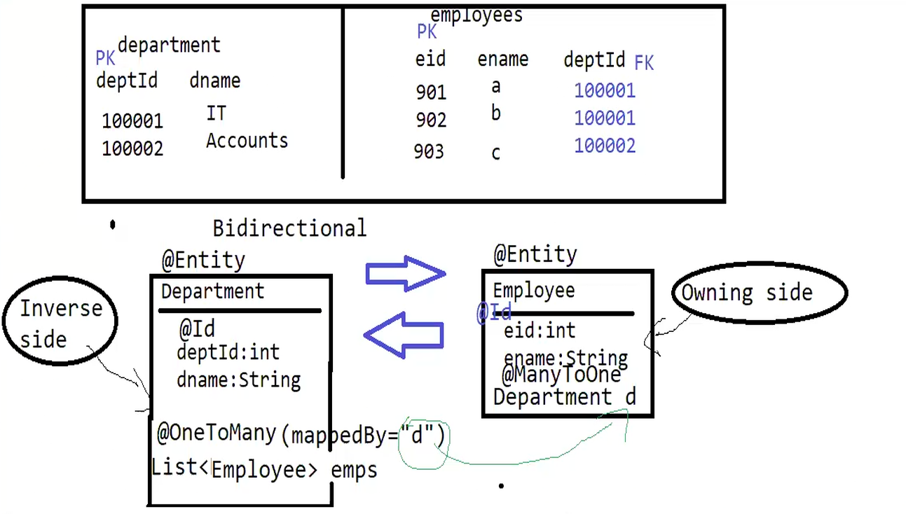

In this project we are creating tables where one department can have multiple employees.
We are using @OneToMany and @ManyToOne annotations to specify the relationship between Department and Employees.
It is a bi-directional relationship, where Department holds the reference to Employees and Employee holds the reference
to Department.



##### Why do we need bi-directional relationship?

In a uni-directional relationship, there is no problem with inserting the department and employee data.
But there is small problem which reading the data.
For example - in one-to-many relationship, department holds the reference to employees. But employees do not hold the
reference to department.
So, if we want to read the department data along with employees, there is no problem.
But if we want to read the employee data along with department, it is not possible because employees do not hold the reference
to department.

So, to solve this problem, we need bi-directional relationship where both department and employees hold the reference to each other.

##### How to create bi-directional relationship?
We will use @OneToMany annotation in Department entity and @ManyToOne annotation in Employee entity.
We will also use mappedBy attribute in @OneToMany annotation to specify the field in Employee entity which holds the reference to Department entity.
This will avoid the creation of extra join table.

##### Cascading

If we run the following code to insert the department and set employees in department. The hibernate will save the department entity
but it will not save the employees because we have not specified any cascading.

```
 Department dept = new Department();
        dept.setDeptId(1);
        dept.setDeptName("IT");

        Employee emp1 = new Employee();
        emp1.setEmpId(101);
        emp1.setEmpName("John Doe");
        emp1.setEmpSal(50000);
        emp1.setDepartment(dept); // Set the department for the employee

        Employee emp2 = new Employee();
        emp2.setEmpId(102);
        emp2.setEmpName("Jane Smith");
        emp2.setEmpSal(60000);
        emp2.setDepartment(dept);

        List<Employee> employees = List.of(emp1, emp2);
        dept.setEmployees(employees);
        repository.addNewDepartment(dept); 
 ```

If we add the cascading attribute in @OneToMany annotation, then hibernate will save the department and employees both.

```java
@OneToMany(mappedBy = "department", cascade = CascadeType.PERSIST)
private List<Employee> employees;
```

The correct way is to create the department, create and save the employee and set the department for each employee.
But we are using cascading here just to demonstrate the bi-directional relationship.

##### Named queries
Using named query to search the department by name. Using named query you can create the query once and use it multiple times.

```
@NamedQuery(name = "Department.findByDeptName", query = "FROM Department d WHERE d.deptName = :deptName")
```
