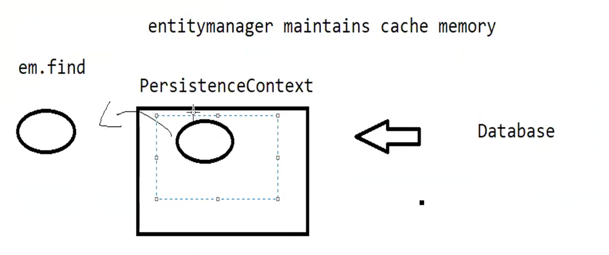

#### How can we store data when employee has two or more addresses?

We can create a separate table for addresses and use @OneToMany and @ManyToOne annotations to specify the relationship
between Employee and Address.
We will create two tables employee_info and address_info. Employee can have multiple addresses.

Using @ElementCollection to store the addresses in a separate table.
Hibernate will automatically create a separate table for addresses and map it to the employee_info table using a foreign
key.

##### How does it decide the name of the table and the foreign key column?

By default, the table name will be employee_info_address [entity class name + field name] and the foreign key column
will be employee_info_id.
We can override the default table name and foreign key column name using @JoinTable and @JoinColumn annotations.

##### find method of EntityManager

The find method of EntityManager is used to retrieve an entity from the database using its primary key

```java
Employee emp = entityManager.find(Employee.class, 1);
```

The first parameter is the entity class and the second parameter is the primary key value.
The find method returns the entity object if found, otherwise it returns null.
It will return only employee object, it will not return the addresses.
By default the collection of addresses is lazy loaded, so the addresses will be loaded only when we access the addresses
field. This improves the performance.

##### Transactional context
Transactional required for insert, update, delete operations. 
For read operations, it is not mandatory but it is a good practice to use transactional context.

````
  Employee emp1 = em.find(Employee.class, empId);
  Employee emp2 = em.find(Employee.class, empId);
````
If we call find method multiple times without using transaction, it will run the query two times and return the same object.
There is a cache called persistence context which is associated with the transaction. 
When we call find method, it will first check the persistence context for the entity object. If it is found in the
persistence context, it will return the object from the cache. If it is not found in the cache, it will run the query and fetch
the object from the database and store it in the persistence context.
So, if we call find method multiple times within the same transaction, it will return the object from the cache and will not run the query again.



@Transactional annotation can be applied at method level or class level.
If we apply @Transactional at class level, it will be applied to all the methods of the class.
If we apply @Transactional at method level, it will be applied only to that method.