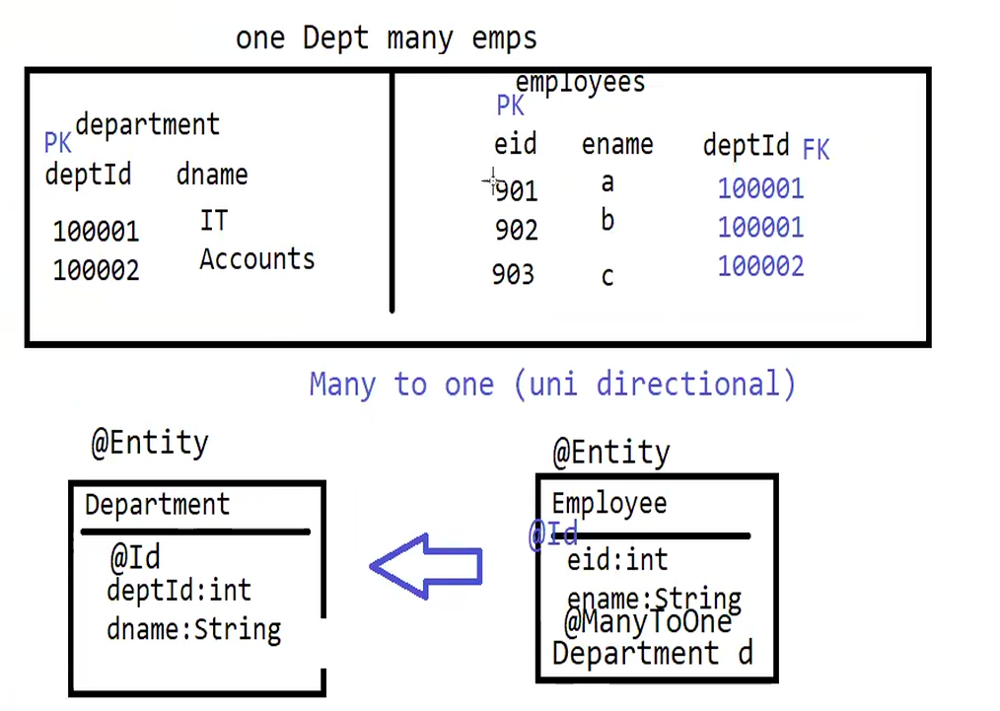

In this project we are creating tables where one department can have multiple employees.
Employee entity will hold the reference to Department entity.
It is a many-to-one relationship between Employee and Department.
We will use @ManyToOne annotation to specify the relationship between Employee and Department.
It is uni directional relationship, where Employee holds the reference to Department but Department does not hold the
reference to Employee.

Department and Employee are two separate entities. Since we are using @ManyToOne annotation, hibernate will automatically
create a foreign key column in Employee table to hold the reference to Department.

