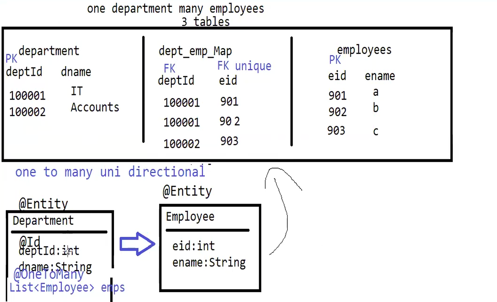

In this project we are creating tables where one department can have multiple employees.
It is a one-to-many relationship between Department and Employee.
We will use @OneToMany annotation to specify the relationship between Department and Employees.
It is uni directional relationship, where Department holds the reference to Employees but Employee does not hold the
reference to Department.

Department and Employee are two separate entities. Since we are using @OneToMany annotation, hibernate will automatically
create a separate table to hold the relationship between Department and Employees.

